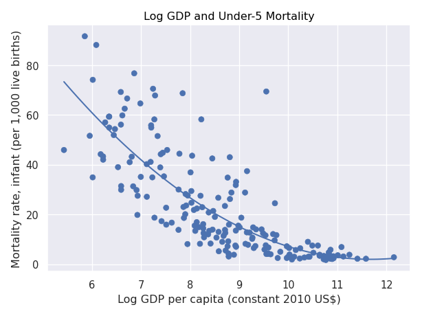

[](https://github.com/nogibjj/Diego_Rodriguez_Individual_Project1/actions/workflows/hello.yml)
[](https://github.com/nogibjj/Diego_Rodriguez_Individual_Project1/actions/workflows/format.yml)
[](https://github.com/nogibjj/Diego_Rodriguez_Individual_Project1/actions/workflows/lint.yml)
[](https://github.com/nogibjj/Diego_Rodriguez_Individual_Project1/actions/workflows/test.yml)
# IDS706-Miniproject3
## File Structure 
```
Diego_Rodriguez_Individual_Project#1/
├── .devcontainer/
│   ├── devcontainer.json
│   └── Dockerfile
├── .github/
│   ├── workflows/hello.yml
|   ├── workflows/format.yml
|   ├── workflows/lint.yml
|   └── workflows/test.yml
├── Images/
│   ├── plot.png
|   └── test_plot.png
├── mylib/
|   └── lib.py
├── .gitignore
├── Data_summary.md
├── main.py
├── Makefile
├── README.md
├── requirements.txt
├── test_lib.py
├── test_main.py
└── test.csv
```

## Purpose of project
The purpose of this project is to present some transformation of data using Polars with World Bank data and automating the publishing process into Data_summary.md with CI/CD. 


## Visualizations
Here is a scatter plot:



Plot result can be found under Images folder and a complete summary of the information under Data_summary.md.

## Some summary statistics:
Describe GDP per capita (constant 2010 US$):

┌────────────┬───────────────┐
│ statistic  ┆ value         │
│ ---        ┆ ---           │
│ str        ┆ f64           │
╞════════════╪═══════════════╡
│ count      ┆ 198.0         │
│ null_count ┆ 19.0          │
│ mean       ┆ 15335.724729  │
│ std        ┆ 22881.30734   │
│ min        ┆ 228.432544    │
│ 25%        ┆ 1835.999      │
│ 50%        ┆ 6155.448169   │
│ 75%        ┆ 17773.005516  │
│ max        ┆ 189464.583635 │
└────────────┴───────────────┘

Describe Mortality rate, infant (per 1,000 live births):

┌────────────┬───────────┐
│ statistic  ┆ value     │
│ ---        ┆ ---       │
│ str        ┆ f64       │
╞════════════╪═══════════╡
│ count      ┆ 193.0     │
│ null_count ┆ 24.0      │
│ mean       ┆ 23.401036 │
│ std        ┆ 21.063532 │
│ min        ┆ 1.7       │
│ 25%        ┆ 6.5       │
│ 50%        ┆ 15.5      │
│ 75%        ┆ 35.1      │
│ max        ┆ 91.6      │
└────────────┴───────────┘
## Requirements
devops
black ==22.3.0 - Formatter 
click == 8.1.3
pytest == 7.4.0  - For Testing
pytest-cov == 4.0.0 - For Testing
nbval==0.10.0 - For Testing

rust based linter
ruff==0.0.284
boto3==1.24.87

web
fastapi == 0.85.0
uvicorn == 0.18.3

Python libraries
polars == 1.7.1
numpy == 2.1.0
seaborn == 0.13.2

## CI/CD
Testing files go with the name test_* and work for main and library files. 

